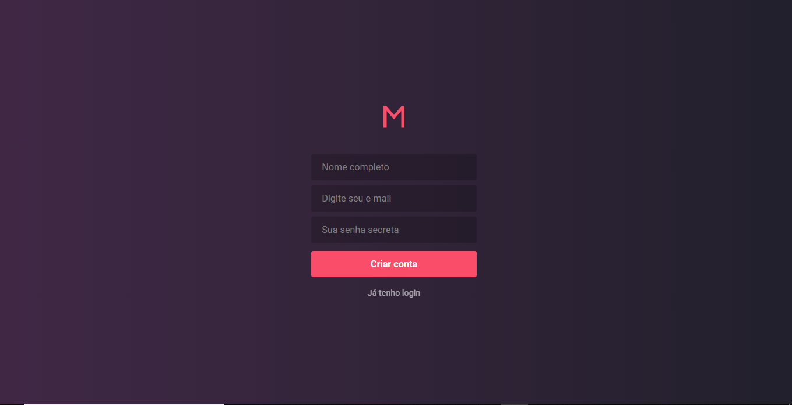
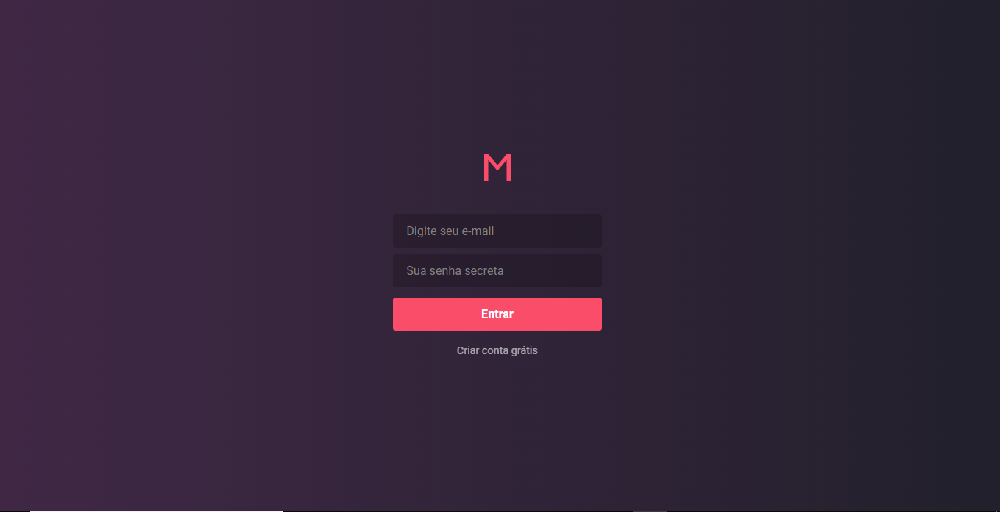
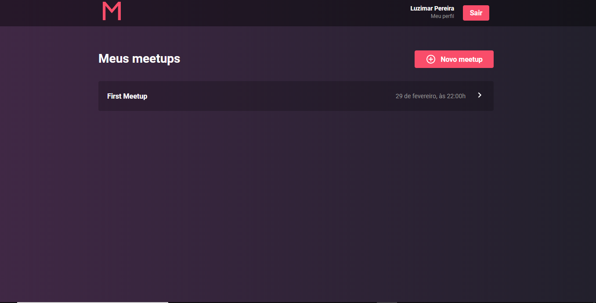
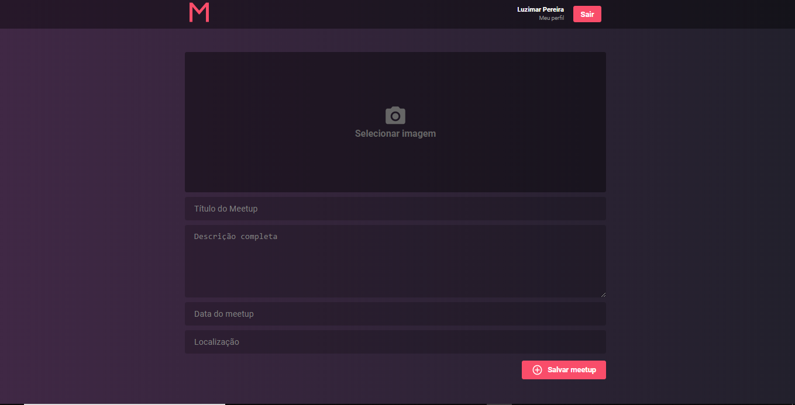
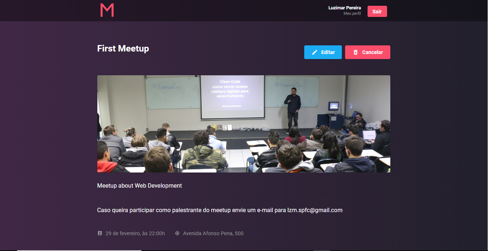
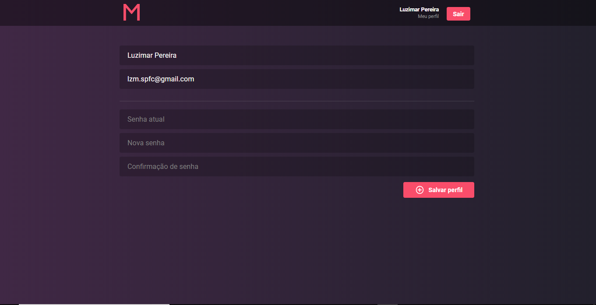

<h1 align="center">
    
</h1>

<h4 align="center">
  Meetapp Web
</h4>

  <a href="#metro-tecnologias">Tecnologias</a>&nbsp;&nbsp;&nbsp;|&nbsp;&nbsp;&nbsp;
  <a href="#-projeto">Projeto</a>&nbsp;&nbsp;&nbsp;|&nbsp;&nbsp;&nbsp;
  <a href="#-dependências">Dependências</a>&nbsp;&nbsp;&nbsp;|&nbsp;&nbsp;&nbsp;
  <a href="#-como-inicializar?">Como inicializar?</a>&nbsp;&nbsp;&nbsp;|&nbsp;&nbsp;&nbsp;

 

  

  

  

  

  

  

## :metro: Tecnologias

Esse projeto foi desenvolvido com as seguintes tecnologias:

- [React](https://reactjs.org)

## 💻 Projeto

O Meetapp Web é uma aplicação para criação de Meetups.

## :fire: Dependências

Para instalar as dependências de pacotes basta:

- npm install ou yarn

## :key: Como inicializar?

Para inicilizar em ambiente local deve-se seguir os passos abaixo:

- npm run start ou yarn start para inicializar
